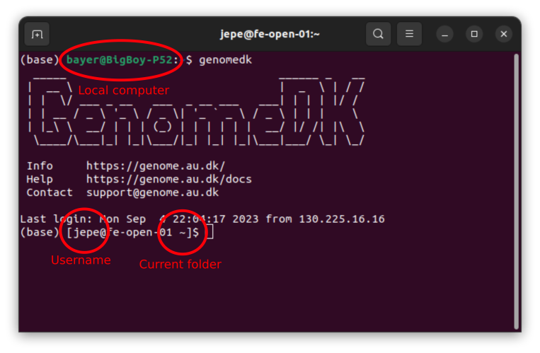
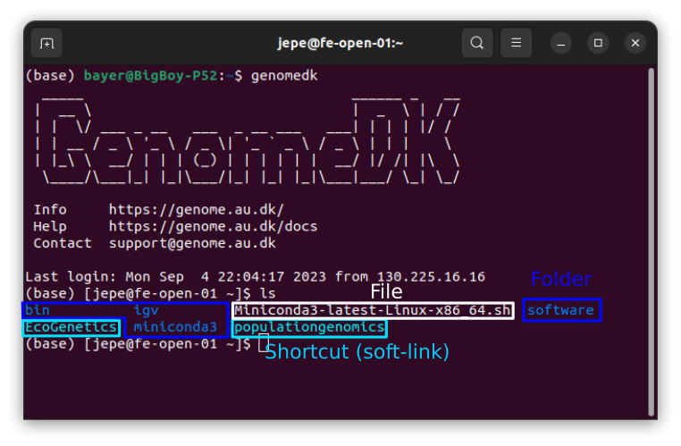
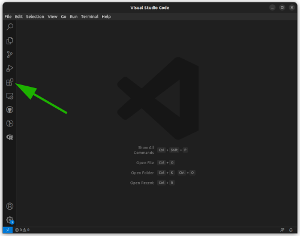
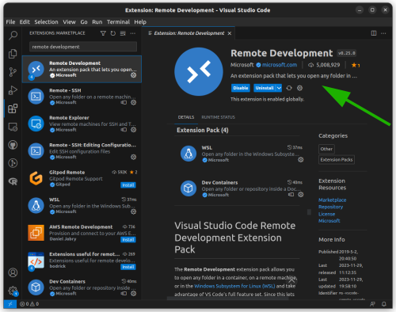
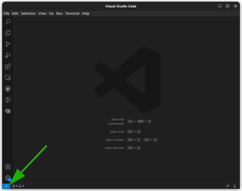
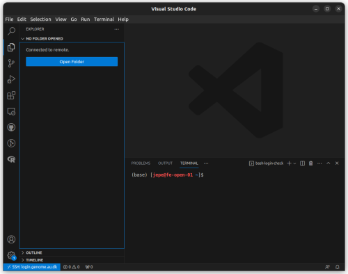
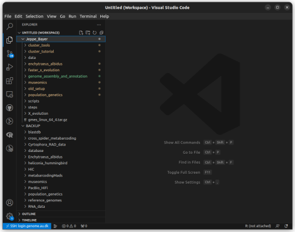
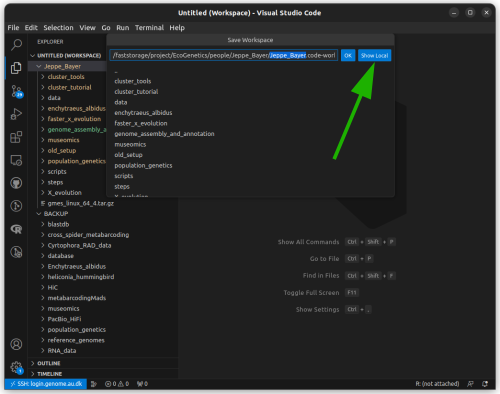

# Welcome to cluster computing

**CONTENT**

- [Welcome to cluster computing](#welcome-to-cluster-computing)
  - [Python, Conda and the terminal](#python-conda-and-the-terminal)
  - [Logging on to the cluster](#logging-on-to-the-cluster)
  - [Your home on the cluster](#your-home-on-the-cluster)
  - [Terminals, file-explorers, and more](#terminals-file-explorers-and-more)
    - [VScode](#vscode)
  - [Master students and above](#master-students-and-above)
    - [Git](#git)

## Python, Conda and the terminal

First things first.
If you do not already have python installed on your computer. I personally recommend just installing *miniconda*. It's a minimal version of something called *Anaconda*. It includes `python` along with the `conda` package manager and can easily be installed on Windows, Mac and Linux. To install miniconda go to this [page](https://docs.conda.io/projects/miniconda/en/latest/) and download the version fitting your computers operating system. (This is not strictly necessary if you do all your work on the cluster, but it is nice to have on your personal computer for any small programming tasks you might want to do)

Pretty much all software you will be using on the cluster is *command-line applications*, meaning programs which are executed through a *terminal* rather than a graphical user interface where you click on icons with a cursor. There are many options for what terminal to use, but all computers come with a built-in standard, which if you're not interested in anything with fancy bells and whistles, will function just fine. On Windows you have *PowerShell* and *CMD*, on Mac it is called *Terminal*, and for you cool kids with Linux it is also called *Terminal*.

When working on the cluster you need to install packages and programs for use in your analyses and pipelines, but sometimes the programs you need for one analysis may conflict with those needed for another. Luckily this is where `conda` helps saves the day! You see conda creates *environments* which work as isolated units, whatever is installed in one environment is completely isolated from whatever is going on in another environment. You can make as many environments as you want, they are easy to swithc between AND `conda` even helps make sure you have any necessary dependencies installed in any given environment!

## Logging on to the cluster


```cmd
  _____                                ______ _   __
 |  __ \                               |  _  \ | / /
 | |  \/ ___ _ __   ___  _ __ ___   ___| | | | |/ /
 | | __ / _ \ '_ \ / _ \| '_ ` _ \ / _ \ | | |    \
 | |_\ \  __/ | | | (_) | | | | | |  __/ |/ /| |\  \
  \____/\___|_| |_|\___/|_| |_| |_|\___|___/ \_| \_/
  ```


Now lets try logging on to the cluster. Open the terminal on your computer and write:

```cmd
ssh <USERNAME>@login.genome.au.dk
```

Where \<USERNAME> is your username on the cluster and press *ENTER*. You should now be prompted for your password, enter it and press *ENTER*.  
As a new safety measure two-step authentication is now mandatory on the cluster, so if you haven't already you need to download the *Microsoft Authenticator* to your phone.  
In the *Microsoft Authenticator* you should tap the '+' icon in the top right and choose 'other'. Now in your terminal, which is still logged on to the cluster, write:

```bash
gdk-auth-show-qr
```

This will show a QR code in your terminal, scan it with your phone.

To activate two-factor authentication write:

```bash
gdk-auth-activate-twofactor <TOKEN>
```

Where \<TOKEN> is the current token from the authenticator app. If everything went well you should now have activated two-factor authentication.

(This only applies if you received you password in an email. If you didn't skip to 'So currently, everytime...') Now, to be a little more annoying with all the safety pre-cautions, you should change your default password. In the terminal write:

```cmd
gdk-auth-change-password
```

Press *ENTER* and you will be prompted for your old password and what your new password should be.

So currently, everytime you log into the cluster you will have you write your password, BUT we can also just tell the cluster that your computer can be trusted, so let's do that!

First, to exit the cluster write:

```cmd
exit
```

When you press *ENTER* the terminal should return to your local computer. While on your local computer write:

```cmd
ssh-keygen -t rsa
```

This will generate a pair of authentication keys. When asked 'Enter file in whhich to save the key' just press *ENTER* and when it asks you to 'Enter a passphrase', again just press *ENTER*.

Now we will create a directory for our new public key on the cluster. Write the following:

```cmd
ssh <USERNAME>@login.genome.au.dk mkdir -p .ssh
```

Press *ENTER* and you will be prompted to enter your password, please do so.

Now we append the public `ssh` key on your local computer to the file `.ssh/authorized_keys` on the cluster. Write the following:

```cmd
cat ~/.ssh/id_rsa.pub | ssh username@login.genome.au.dk 'cat >> .ssh/authorized_keys'
```

Press *ENTER* and you will again be asked to enter you password (for the last time). From now on you can log into the cluster from your local computer without being prompted for a password.

## Your home on the cluster

Let's log back into the cluster, do you remember how? Just in case, here is the command again:

```cmd
ssh <USERNAME>@login.genome.au.dk
```

Notice how you didn't have to write your password!

When you log into the cluster you start out in your private home folder. You can see this by the '~' on the prompt


If you want to have a look at what's inside your current folder your can write:

```bash
ls
```

For me it looks like this:  
  
You should see the text in different colors. The colors signify what you are looking at, like in my case where turqouis are shortcuts (or what is called 'soft-links'), blue are folders and white are files. Take note of the name in turqouis, this will reflect the name of the *'project'* that you're a part of and we will use it later.

A thing you might have noticed is that I have a *miniconda* folder and you don't, so now we need *miniconda* on the cluster. In the terminal write:

```bash
wget https://repo.anaconda.com/miniconda/Miniconda3-latest-Linux-x86_64.sh
```

This will download the latest version of *miniconda* to your current folder. when it's done write:

```bash
bash Miniconda3-latest-Linux-x86_64.sh
```

This runs the script and installs *miniconda*. Just follow the instructions and say 'yes' when it asks you if it should run `conda init`. When it's done you can check if there is a new folder with the `ls` command. You should also notice a small '(base)' next to your prompt. This indicates you current environment, which in this case is the 'base' environment.

## Terminals, file-explorers, and more

When working with code, and working with code on a cluster, there are many option as to terminals, file-explorers, script-editors, and what have you! However, my personal preference and recommendation is to use [VScode](https://code.visualstudio.com/). This acts as an effective all-in-one, you'll have terminal, file explorer and script editor all in one place. To further incite you to make this (the right) choice, I've even made a little guide to setting up VScode ready for you.

### VScode

For start to the [VScode website](https://code.visualstudio.com/), download the program and follow the on-screen intructions.  
Once you have installed VScode, you should install the *Remote Development* extension. You do that by clicking the funny squares in the left bar of VScode and search for 'Remote Development':  


Once installed, you can click the small square with two arrows in the lower-left corner to connect to the cluster:  


Select '*Connect current window to host*' then '*Add new SSH host*', and type:

```cmd
ssh <USERNAME>@login.genome.au.dk
```

Now select the config file `.ssh/config`. Now you can click the  square in the lower-left corner again to connect to the cluster by selecting *login.genome.au.dk*. It may take a bit, but once it is done installing the remote server, you will have easy access to the cluster through VScode. It should look something like this:  


And now? Now we get comfortable! Click on *'Open folder'* and make your path similar to this: */faststorage/project/<PROJECT_NAME>/people/<YOUR_FOLDER>/*, then click *'OK'*. This could lead to anywhere, and depending on what project you're a part of the structure may be slightly different, except the first three parts, they are in common for all projects on the GenomeDK cluster. Lets add another folder that will come in practical. Right-click on the blank space below the folder on the right and select *'Add Folder to Workspace...'*, now make the path similar to this: */faststorage/project/<PROJECT_NAME>/BACKUP/*. For me it now looks like this:  


Hopefully yours looks similar. And if it does, you now have comfortable access to, and view of, the folders and files you're going to be working with. Let us save this setup as a workspace-file. Click on '*File*' in the upper left corner and then on *'Save Workspace as...'*. In the window that pops up click on '*Show Local*':  


Now find somewhere suitable to save the file with a proper name. VScode will always try to reopen in the state you last closed it down but if you open the workspace-file it will always open in last stage of that perticular workspace. Next step is to install some useful extensions. You can install any extension you think sounds useful but i want you to install to specific extensions: *Python* and *ShellCheck*. You should know where to go now to install these. Another extension that may be useful for is the *R* extension, if you do this make sure you follow the installation instructions. If you do and still have trouble find me and I'll help.

Congratulations! Now VScode is set and you're ready to go!

## Master students and above

### Git


[Git](https://git-scm.com/) is a free and open source distributed version control system designed to handle everything from small to very large projects with speed and efficiency.

That's right, it's `git`. You may think it's optional but it's not. I know what you're thinking: "I don't need git, it seems needlessly complicated..." Stop it! You're going to use it... it has been decided... by me... and I'm in charge. Now go create a [GitHub account](https://github.com/). Off you go. I'll wait. Did you do it? Good! Welcome back then!

`Git` in combination with GitHub is perfect for keeping our projects save, accessible and reproducible. And wonderfully enough, it integrates perfectly with our working environment in VScode.